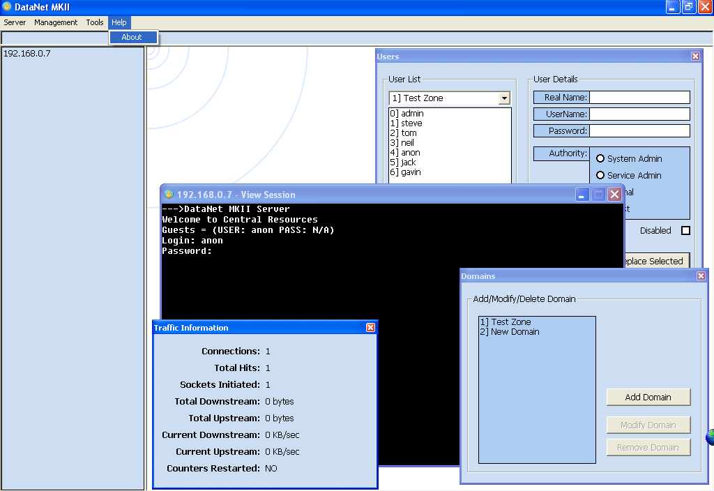



## A Telnet Server \!\!\!\! \- DataNet MKII

### Description

A very powerfull telnet server with a user-friendly interface. Works on a plugin DLL framework.
 
### More Info
 

             |
---                |---
**Submitted On**   |2005-06-03 23:13:22
**By**             |[Proxy Avoidance](https://github.com/Planet-Source-Code/PSCIndex/blob/master/ByAuthor/proxy-avoidance.md)
**Level**          |Advanced
**User Rating**    |5.0 (20 globes from 4 users)
**Compatibility**  |VB 6\.0
**Category**       |[Complete Applications](https://github.com/Planet-Source-Code/PSCIndex/blob/master/ByCategory/complete-applications__1-27.md)
**World**          |[Visual Basic](https://github.com/Planet-Source-Code/PSCIndex/blob/master/ByWorld/visual-basic.md)
**Archive File**   |[A\_Telnet\_S189745652005\.zip](https://github.com/Planet-Source-Code/proxy-avoidance-a-telnet-server-datanet-mkii__1-60678/archive/master.zip)

